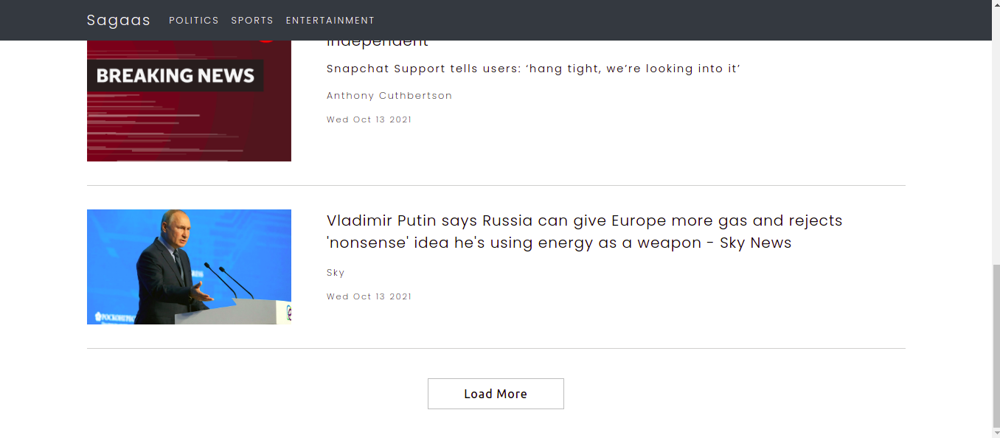

<h1>Sagaas News Feed</h1>

### Introduction
A single page application to browse through latest news at United Kingom.

  </a>

### Running in your local

- `git clone https://github.com/ranjansaga/news-feed.git`
- `npm install` (after navigating inside the directory)
- `npm install` (inside the client folder)
- `npm run dev` (Run this from the root folder. This starts both backend and front end server)

### React Components Used

- App.js : Container component that holds the state.
- SearchBar : Functional component that takes care of search.
- NewsList : Functional component which holds all the news feed.
- NewsItem : Functional component that represents one news item in the feed.

### Technologies

- [React](https://reactjs.org/) with hooks
- [react-bootstrap](https://react-bootstrap.github.io/)
- [Express](https://expressjs.com/)
- [Nodejs](https://nodejs.dev)
- [newsapi.org](https://newsapi.org/docs)
- [React Testing library](https://testing-library.com/docs/)

----------------------------------------------------------------

More features coming soon
